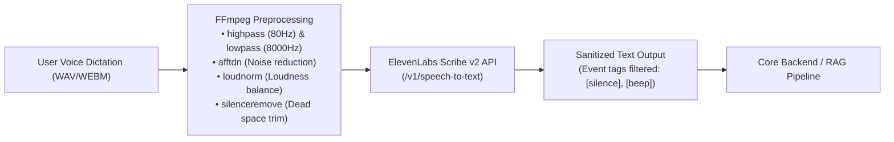
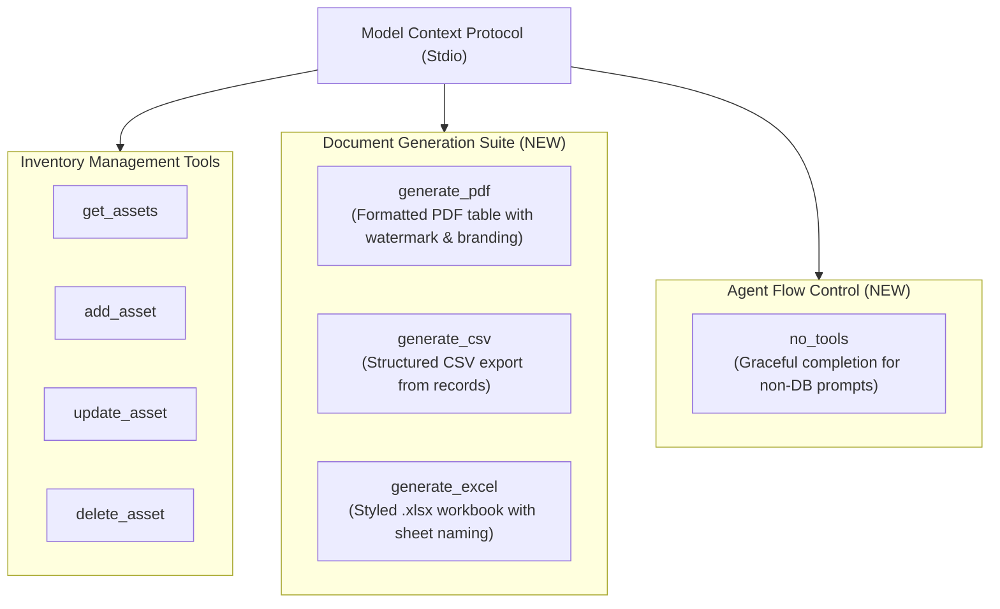
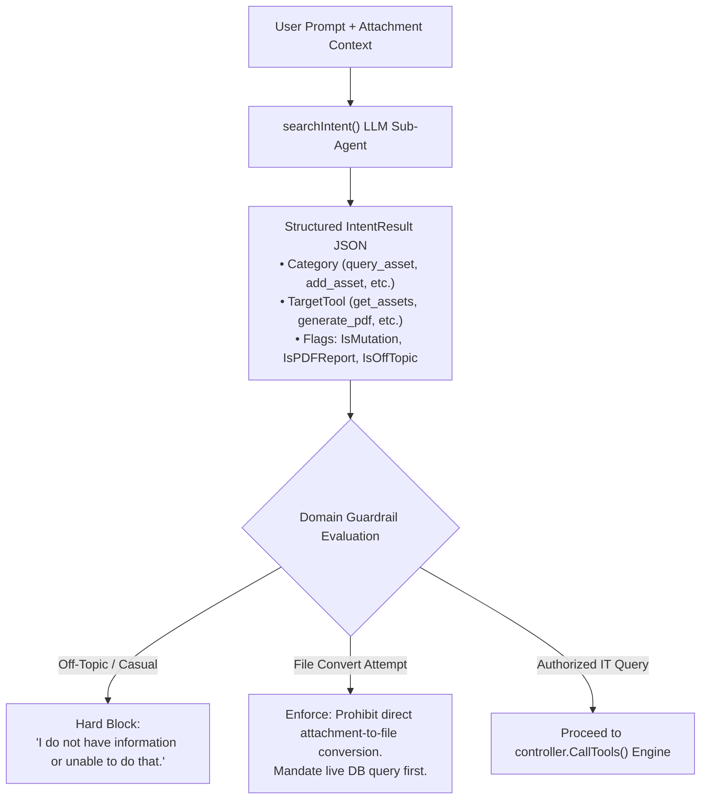

# System Evolution & Platform Updates: From Baseline Specification to Current System

> **Document Name:** System Differences & Platform Evolution Analysis  
> **Reference Baseline:** [TECHNICAL_DOCUMENTATION.md](file:///c:/Users/user/OneDrive/Documents/proyek_DH/QTERA/pocAI2/TECHNICAL_DOCUMENTATION.md)  
> **Target Repository:** `QTERA/pocAI2`  
> **Date:** September 2026  
> **Status:** Platform Evolution Report  

---

## 1. Executive Summary

This document details the **architectural updates and functional enhancements** that have been introduced to the **QTERA Asset Management & Intelligent Assistant Platform**, comparing the baseline architecture described in [TECHNICAL_DOCUMENTATION.md](file:///c:/Users/user/OneDrive/Documents/proyek_DH/QTERA/pocAI2/TECHNICAL_DOCUMENTATION.md) with the active, expanded codebase.

The current system has evolved significantly beyond the initial baseline specification. It has transitioned from a single-channel, 4-tool inventory prototype into an **enterprise-ready, multimodal ecosystem** featuring automated document generation (PDF/Excel/CSV), studio-grade speech transcription, a cross-platform mobile client, an intelligent multi-agent intent routing pipeline, and expanded model catalog integration.

```mermaid
flowchart LR
    subgraph Baseline ["Baseline Specification (v2.0 Doc)"]
        B1["4 MCP Inventory Tools"]
        B2["Offline Whisper STT"]
        B3["Web Client Only (React + Vite)"]
        B4["Plain Text RAG Responses"]
        B5["Keyword-based Mutation Matching"]
        B6["PDF & Image OCR Extraction"]
    end

    subgraph Current ["Current System Updates"]
        C1["8 MCP Tools (PDF, CSV, Excel, No-Tools)"]
        C2["ElevenLabs Scribe v2 + FFmpeg Studio Filter"]
        C3["Dual Client: Web + Expo React Native Mobile"]
        C4["Structured AgentResult JSON with File Downloads"]
        C5["LLM Intent Classifier Sub-Agent & Guardrails"]
        C6["Multimodal Ingestion (Excel, CSV, WebP, Text)"]
    end

    Baseline ==>|"Platform Evolution & Upgrades"| Current
```



---

## 2. Platform Evolution & Updates Matrix

The following matrix highlights each component's progression from the baseline technical specification to the current system implementation:

| # | System Area / Module | Baseline Specification ([TECHNICAL_DOCUMENTATION.md](file:///c:/Users/user/OneDrive/Documents/proyek_DH/QTERA/pocAI2/TECHNICAL_DOCUMENTATION.md)) | Current Updated Implementation | Value & Capabilities Added |
|---|---|---|---|---|
| **1** | **Speech-to-Text (STT)** | Offline `whisper.cpp` engine using local model `ggml-base.en.bin` and binary execution. | Cloud-native **ElevenLabs Scribe v2** API with custom FFmpeg audio preprocessing in [transcribe.go](file:///c:/Users/user/OneDrive/Documents/proyek_DH/QTERA/pocAI2/server/GO/controller/transcribe.go). | Superior transcription accuracy, multilingual Indonesian-English recognition, and automatic noise/silence suppression. |
| **2** | **MCP Tooling & Reporting** | 4 core database tools (`get_assets`, `add_asset`, `update_asset`, `delete_asset`). | **8 tools** in [mcp_server/server.go](file:///c:/Users/user/OneDrive/Documents/proyek_DH/QTERA/pocAI2/mcp_server/server.go), adding `generate_pdf`, `generate_csv`, `generate_excel`, and `no_tools`. | Autonomous document compilation: AI can directly query inventory and export branded PDF tables, CSVs, or Excel workbooks. |
| **3** | **Client Ecosystem** | Single client application: `ai-registration-frontend` (React 18 + Vite). | **Dual Ecosystem**: Web client + cross-platform mobile client in [react_native/eiai_react/](file:///c:/Users/user/OneDrive/Documents/proyek_DH/QTERA/pocAI2/react_native/eiai_react). | Mobile field accessibility: operators can manage assets and interact with AI from iOS and Android devices. |
| **4** | **AI Reasoning & Guardrails** | Naive string matching (`isMutationIntent`) for detecting mutations. | Dedicated LLM-powered **`searchIntent()` sub-agent** with strict domain boundary checks in [models.go](file:///c:/Users/user/OneDrive/Documents/proyek_DH/QTERA/pocAI2/eiai_go/controller/models.go#L493). | Highly resilient natural language understanding, prevention of off-topic hallucination, and guardrails against file-conversion abuse. |
| **5** | **RAG Output & File Delivery** | Plain text HTTP 200 responses delivered over WebSocket. | Structured **`AgentResult` JSON** with download URLs and attachment cards in [eiai_go/main.go](file:///c:/Users/user/OneDrive/Documents/proyek_DH/QTERA/pocAI2/eiai_go/main.go#L167). | Interactive attachment delivery: users can download generated reports directly from chat message bubbles. |
| **6** | **AI Model Selection** | Binary switch between `qwen` and legacy `smolLM`. | **8-Model Normalized Catalog** in [resolve.go](file:///c:/Users/user/OneDrive/Documents/proyek_DH/QTERA/pocAI2/eiai_go/controller/resolve.go) with alias resolution and frontend selector. | Flexibility to route requests across state-of-the-art models (DeepSeek V4, GLM 5.3, GPT-5.6 Luna, MiMo V2.5, OX Alpha, etc.). |
| **7** | **Document Extraction** | Limited to PDF text parsing and image OCR. | Expanded multimodal parser supporting **Excel (.xlsx, .xls)**, **CSV**, **WebP**, and **plain text** in [extract.go](file:///c:/Users/user/OneDrive/Documents/proyek_DH/QTERA/pocAI2/eiai_go/controller/extract.go). | Users can upload spreadsheets and asset registries directly into the chat for automated multi-item batch import. |
| **8** | **Attachment Memory & Caching** | Single-shot attachment processing per message request. | **Multi-turn attachment cache** (`attachmentCache`) and retroactive historical attachment retrieval in [decode_jwt.go](file:///c:/Users/user/OneDrive/Documents/proyek_DH/QTERA/pocAI2/eiai_go/controller/decode_jwt.go). | Conversational persistence: users can ask follow-up questions about an attached invoice/spreadsheet across multiple turns. |
| **9** | **Chat History Persistence** | 8 basic columns in `public.chat` (text and basic user metadata). | **13 columns** in [SendMessage.go](file:///c:/Users/user/OneDrive/Documents/proyek_DH/QTERA/pocAI2/server/GO/controller/SendMessage.go#L92) and [chat.go](file:///c:/Users/user/OneDrive/Documents/proyek_DH/QTERA/pocAI2/server/GO/models/chat.go) including 5 attachment fields. | Complete audit trail preserving uploaded documents and AI-generated report metadata in the database. |
| **10** | **Export REST Endpoints** | Only core CRUD endpoints documented in Section 5. | Added `POST /api/pdf`, `POST /api/csv`, `POST /api/excel`, and static `/uploads` in [server/GO/main.go](file:///c:/Users/user/OneDrive/Documents/proyek_DH/QTERA/pocAI2/server/GO/main.go). | Dedicated export micro-services accessible by both the MCP server and external integrations. |

---

## 3. Deep Dive into System Updates

### 3.1 Upgrade 1: Cloud-Native Speech-to-Text with ElevenLabs Scribe v2

#### Baseline Design:
The initial specification detailed an offline transcription setup utilizing `whisper-cli.exe` and quantized GGML models (`ggml-base.en.bin`), which required manual binary compilations and localized hardware inference.

#### Current System Evolution:
The speech transcription subsystem has been upgraded in [server/GO/controller/transcribe.go](file:///c:/Users/user/OneDrive/Documents/proyek_DH/QTERA/pocAI2/server/GO/controller/transcribe.go) to use **ElevenLabs Scribe v2**, an advanced, cloud-native multilingual speech recognition model.



1. **Studio-Grade Audio Preprocessing:**
   Before audio reaches the transcription API, [preprocessAudio()](file:///c:/Users/user/OneDrive/Documents/proyek_DH/QTERA/pocAI2/server/GO/controller/transcribe.go#L29) applies a 5-stage FFmpeg filter chain:
   * **Highpass Filter (`80Hz`):** Removes microphone pops, handling noise, and mechanical vibrations.
   * **Lowpass Filter (`8000Hz`):** Eliminates electronic hiss and high-frequency interference.
   * **FFT Denoiser (`afftdn`):** Filters ambient background hums from air conditioners, fans, and rooms.
   * **EBU R128 Loudness Normalization (`loudnorm`):** Normalizes speech amplitude for quiet or dynamic speakers.
   * **Silence Removal (`silenceremove`):** Strips leading and trailing dead silence, lowering payload sizes.
2. **Audio Event Sanitization:**
   Transcription results automatically detect and purge non-verbal event tags (`[beep]`, `[silence]`, `[applause]`, `[music]`), ensuring only genuine spoken words reach the prompt router.

---

### 3.2 Upgrade 2: Expanded MCP Suite with Automated Document Generation

#### Baseline Design:
The baseline MCP server provided 4 primitive database manipulation tools (`get_assets`, `add_asset`, `update_asset`, `delete_asset`).

#### Current System Evolution:
The MCP server in [mcp_server/server.go](file:///c:/Users/user/OneDrive/Documents/proyek_DH/QTERA/pocAI2/mcp_server/server.go) has expanded to **8 tools**, unlocking document synthesis and explicit completion signaling:



* **`generate_pdf`:** Builds professionally formatted PDF reports using `go-pdf/fpdf` in [pdfMaker.go](file:///c:/Users/user/OneDrive/Documents/proyek_DH/QTERA/pocAI2/server/GO/controller/pdfMaker.go). It automatically generates zebra-striped data rows, column headers, company watermarks, and persists files to `/uploads/pdf/`.
* **`generate_csv`:** Compiles database query results into formatted CSV files in [csvMaker.go](file:///c:/Users/user/OneDrive/Documents/proyek_DH/QTERA/pocAI2/server/GO/controller/csvMaker.go).
* **`generate_excel`:** Generates Microsoft Excel `.xlsx` spreadsheets using `xuri/excelize` in [excelMaker.go](file:///c:/Users/user/OneDrive/Documents/proyek_DH/QTERA/pocAI2/server/GO/controller/excelMaker.go), complete with custom sheet names and styled header rows.
* **`no_tools`:** Emitted when a query is a greeting, casual conversation, or an unauthorized action, allowing the model to complete cleanly without hallucinating database calls.

---

### 3.3 Upgrade 3: Cross-Platform Mobile Client (`react_native/eiai_react`)

#### Baseline Design:
The technical documentation specified only the web-based SPA (`ai-registration-frontend`).

#### Current System Evolution:
The repository now includes a production-grade mobile client built with **Expo / React Native** in [react_native/eiai_react/](file:///c:/Users/user/OneDrive/Documents/proyek_DH/QTERA/pocAI2/react_native/eiai_react):

* **Architectural Parity:** The mobile client replicates the complete feature set of the web dashboard:
  - **Auth & Tenant Binding:** [auth-page.tsx](file:///c:/Users/user/OneDrive/Documents/proyek_DH/QTERA/pocAI2/react_native/eiai_react/src/components/auth/auth-page.tsx) with company selection and JWT session persistence.
  - **Asset Catalog:** [asset-list-page.tsx](file:///c:/Users/user/OneDrive/Documents/proyek_DH/QTERA/pocAI2/react_native/eiai_react/src/components/assets/asset-list-page.tsx) with real-time search, category filtering, and sorting.
  - **Asset Creation & Modification:** [asset-form-page.tsx](file:///c:/Users/user/OneDrive/Documents/proyek_DH/QTERA/pocAI2/react_native/eiai_react/src/components/assets/asset-form-page.tsx) with form validations.
  - **Conversational Copilot:** [chat-view.tsx](file:///c:/Users/user/OneDrive/Documents/proyek_DH/QTERA/pocAI2/react_native/eiai_react/src/components/chat/chat-view.tsx) with live WebSocket messaging, chat history synchronization, and responsive design support.

---

### 3.4 Upgrade 4: Advanced Intent Classification Sub-Agent & Domain Guardrails

#### Baseline Design:
Section 3.2.1 described intent detection using naive keyword searches (`isMutationIntent`) that looked for words like *create*, *add*, *update*, or *delete*.

#### Current System Evolution:
In [models.go](file:///c:/Users/user/OneDrive/Documents/proyek_DH/QTERA/pocAI2/eiai_go/controller/models.go#L493), the orchestrator now employs an intelligent **Intent Classification Sub-Agent** (`searchIntent()`):



1. **Structured Intent Categorization:**
   Every message is parsed into normalized categories: `query_asset`, `add_asset`, `update_asset`, `delete_asset`, `generate_pdf`, `file_conversion`, `greeting`, and `unrelated`.
2. **Domain Boundary Guardrail:**
   The assistant strictly rejects out-of-domain requests (coding assistance, recipes, general conversation) immediately with:
   > *"I do not have information or unable to do that."*
3. **Anti-File-Conversion Safeguard:**
   To prevent hallucinated file transformations, the agent strictly enforces that reports (`generate_pdf`, `generate_csv`, `generate_excel`) can **only** be generated from live database queries (`get_assets`). Converting uploaded files without querying live company inventory is programmatically blocked.

---

### 3.5 Upgrade 5: Structured Agent Protocol with Direct Attachment Downloads

#### Baseline Design:
The technical documentation stated that `/rag` returns a simple plain text string response delivered via WebSocket.

#### Current System Evolution:
The communication protocol between `eiai_go`, `server/GO`, and client interfaces has been upgraded to a structured payload format:

* **Signature:** [models.go:L603](file:///c:/Users/user/OneDrive/Documents/proyek_DH/QTERA/pocAI2/eiai_go/controller/models.go#L603) returns `(*AgentResult, error)`.
* **Payload Structure:**
  ```json
  {
    "answer": "Berikut adalah laporan inventaris aset yang telah berhasil dibuat.",
    "attachment": {
      "name": "asset_inventory_report.pdf",
      "url": "/uploads/pdf/table_1725781234.pdf",
      "type": "application/pdf",
      "size": 42150
    }
  }
  ```
* **Interactive Frontend Card:**
  In [Chat.jsx](file:///c:/Users/user/OneDrive/Documents/proyek_DH/QTERA/pocAI2/ai-registration-frontend/src/Chat.jsx#L407-L453), the chat interface automatically detects the `attachment` field and renders an interactive document pill showing the file type icon, human-readable size (`41.2 KB`), document title, and a direct download button.

---

### 3.6 Upgrade 6: 8-Model Normalized LLM Catalog

#### Baseline Design:
The baseline documentation only referenced a basic binary choice between `qwen` and `smolLM`.

#### Current System Evolution:
The AI subsystem in [resolve.go](file:///c:/Users/user/OneDrive/Documents/proyek_DH/QTERA/pocAI2/eiai_go/controller/resolve.go) now provides an 8-model catalog with alias normalization:

| # | Model Identifier | Provider / Engine | Primary Strength |
|---|---|---|---|
| **1** | `ox-alpha-free` | OpenCode-Go (Default) | Ultra-fast inference, ideal for tool routing and quick queries. |
| **2** | `glm-5.3-flash` | GLM / Z-AI | Multilingual proficiency, excellent for Indonesian prompts. |
| **3** | `mimo-v2.5` | OpenCode-Go | Balanced conversational reasoning. |
| **4** | `gpt-5.6-luna` | OpenAI Endpoint | Advanced analytical calculation and complex table synthesis. |
| **5** | `qwen3.8-flash` | Qwen / Alibaba Cloud | High-speed structured JSON tool-call emission. |
| **6** | `deepseek-v4-flash`| DeepSeek | Complex logic, multi-turn reasoning, and aggregation. |
| **7** | `liquid/lfm-2.5-2.6b:free` | Liquid AI (Legacy `smollm`) | Lightweight edge inference. |
| **8** | `z-ai/glm-5.2:free` | Z-AI | General fallback free tier. |

Both the web UI ([Chat.jsx](file:///c:/Users/user/OneDrive/Documents/proyek_DH/QTERA/pocAI2/ai-registration-frontend/src/Chat.jsx#L554-L562)) and backend routers support dynamic hot-swapping between any of these models via standard aliases.

---

### 3.7 Upgrade 7: Comprehensive Multimodal Ingestion & Spreadsheet Parsing

#### Baseline Design:
Text extraction was documented solely for PDF files and images (Tesseract OCR).

#### Current System Evolution:
The extraction pipeline in [extract.go](file:///c:/Users/user/OneDrive/Documents/proyek_DH/QTERA/pocAI2/eiai_go/controller/extract.go) handles diverse enterprise document types:

* **Excel Workbooks (`.xlsx`, `.xls`):** Built with `xuri/excelize/v2`, [ExtractExcelText()](file:///c:/Users/user/OneDrive/Documents/proyek_DH/QTERA/pocAI2/eiai_go/controller/extract.go#L111) iterates across all workbook sheets, extracting headers and row values into structured markdown tables.
* **CSV Registries (`.csv`):** Built with standard Go `encoding/csv`, converting comma-delimited data into formatted text prompts.
* **Multilingual OCR:** In [ExtractImageOCR()](file:///c:/Users/user/OneDrive/Documents/proyek_DH/QTERA/pocAI2/eiai_go/controller/extract.go#L33), Tesseract is configured with dual language packs (`eng+ind`) with automated fallback, supporting `.png`, `.jpg`, `.jpeg`, and `.webp`.
* **Multi-Turn Attachment Memory:** In [decode_jwt.go](file:///c:/Users/user/OneDrive/Documents/proyek_DH/QTERA/pocAI2/eiai_go/controller/decode_jwt.go#L140), attachment contents are cached in-memory (`attachmentCache`). If a user uploads an asset registry in message 1, then asks *"Which of these are laptops?"* in message 2, the system automatically pulls the cached document context from conversation history without requiring a re-upload.

---

### 3.8 Upgrade 8: Database Schema Enhancements for Attachments

#### Baseline Design:
`public.chat` was specified with 8 basic columns (`id`, `user`, `chat`, `created_at`, `user_id`, `username`, `role`, `models`).

#### Current System Evolution:
To support persistent multimodal conversational workflows, `public.chat` in [SendMessage.go](file:///c:/Users/user/OneDrive/Documents/proyek_DH/QTERA/pocAI2/server/GO/controller/SendMessage.go#L92-L98) and [models/chat.go](file:///c:/Users/user/OneDrive/Documents/proyek_DH/QTERA/pocAI2/server/GO/models/chat.go) has been expanded to **13 columns**:

```sql
ALTER TABLE public.chat ADD COLUMN IF NOT EXISTS attachment_name text;
ALTER TABLE public.chat ADD COLUMN IF NOT EXISTS attachment_url text;
ALTER TABLE public.chat ADD COLUMN IF NOT EXISTS attachment_type text;
ALTER TABLE public.chat ADD COLUMN IF NOT EXISTS attachment_size bigint;
ALTER TABLE public.chat ADD COLUMN IF NOT EXISTS attachment_text text;
```

This guarantees that both user-uploaded source files and AI-generated report links remain permanently accessible when reloading historical chat sessions.

---

### 3.9 Upgrade 9: Dedicated Export REST Endpoints

#### Baseline Design:
Section 5 of the documentation detailed only authentication, CRUD assets, and chat endpoints.

#### Current System Evolution:
In [server/GO/main.go](file:///c:/Users/user/OneDrive/Documents/proyek_DH/QTERA/pocAI2/server/GO/main.go#L30-L33), dedicated micro-service endpoints were added:
* `POST /api/pdf` ([pdfMaker.go](file:///c:/Users/user/OneDrive/Documents/proyek_DH/QTERA/pocAI2/server/GO/controller/pdfMaker.go)): Directly accepts JSON arrays of headers and rows and compiles downloadable PDFs.
* `POST /api/csv` ([csvMaker.go](file:///c:/Users/user/OneDrive/Documents/proyek_DH/QTERA/pocAI2/server/GO/controller/csvMaker.go)): Converts tabular data into downloadable CSV files.
* `POST /api/excel` ([excelMaker.go](file:///c:/Users/user/OneDrive/Documents/proyek_DH/QTERA/pocAI2/server/GO/controller/excelMaker.go)): Builds `.xlsx` workbooks with custom titles and sheets.
* `GET /uploads/*`: Statically hosts generated reports and persistent user uploads with CORS support.

---

## 4. Developer & Operational Notes

In addition to feature enhancements, several operational provisions exist in the active codebase:

1. **Telemetry & Fast-Path Authentication (`token123`):**
   A convenience token (`token123`) is supported in [auth.go](file:///c:/Users/user/OneDrive/Documents/proyek_DH/QTERA/pocAI2/server/GO/middleware/auth.go#L94) and [assets.go](file:///c:/Users/user/OneDrive/Documents/proyek_DH/QTERA/pocAI2/server/GO/controller/assets.go#L31). It allows developer telemetry, benchmark scripts, and internal MCP server requests to bypass external authentication services during local evaluation.
2. **Dynamic Header Forwarding:**
   The MCP server automatically forwards tenant credentials (`X-Company`, `X-Role`, `X-User-ID`), enabling the backend to isolate queries to the caller's organization without requiring full JWT roundtrips for each tool call.
3. **Database Initialization:**
   The database schema can be verified directly from the models in [server/GO/models/](file:///c:/Users/user/OneDrive/Documents/proyek_DH/QTERA/pocAI2/server/GO/models/) and the PRD specifications in [ai-registration/04-data.md](file:///c:/Users/user/OneDrive/Documents/proyek_DH/QTERA/pocAI2/ai-registration/04-data.md).

---

## 5. Summary: Synchronizing the Technical Documentation

To bring [TECHNICAL_DOCUMENTATION.md](file:///c:/Users/user/OneDrive/Documents/proyek_DH/QTERA/pocAI2/TECHNICAL_DOCUMENTATION.md) up to date with the current system state, the following documentation updates should be incorporated:

1. **Update Architecture Diagram:** Add the 4 new MCP tools (`generate_pdf`, `generate_csv`, `generate_excel`, `no_tools`), replace the Whisper engine block with ElevenLabs Scribe v2 + FFmpeg, and add the Expo React Native mobile client.
2. **Update Tool Registry (Section 3.3):** Document all 8 MCP tools and their respective parameters.
3. **Update API Reference (Section 5):** Add `/api/pdf`, `/api/csv`, `/api/excel`, and `/api/Tools`. Clarify that `/rag` returns structured `AgentResult` JSON.
4. **Update ER Diagram & Schema (Section 4):** Add the 5 attachment fields to the `public.chat` table specification.
5. **Update Model Catalog (Section 3.2):** Document the 8 supported LLM models and alias routing rules from [resolve.go](file:///c:/Users/user/OneDrive/Documents/proyek_DH/QTERA/pocAI2/eiai_go/controller/resolve.go).
6. **Update Directory Tree (Section 8):** Add `pdfMaker.go`, `csvMaker.go`, `excelMaker.go`, `resolve.go`, `react_native/eiai_react`, and `ai-registration/`.
